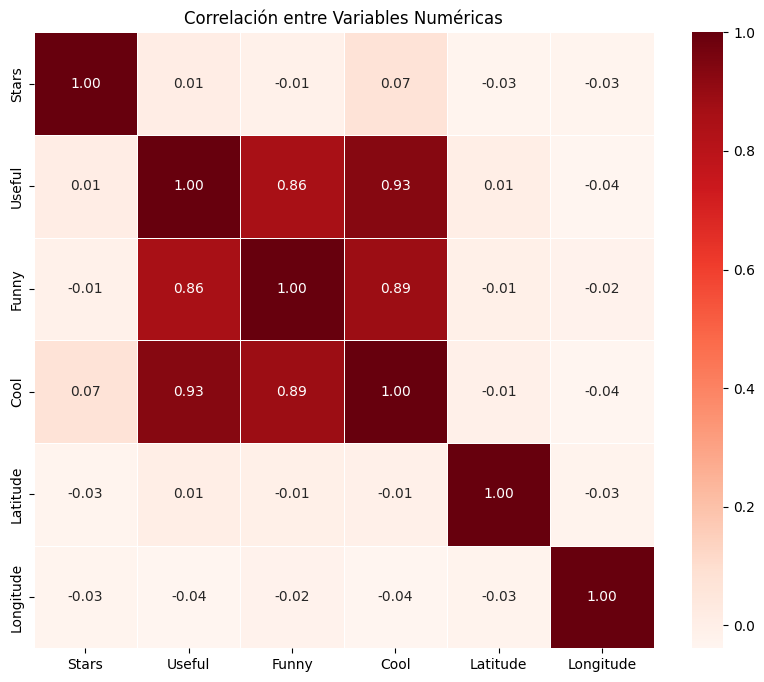
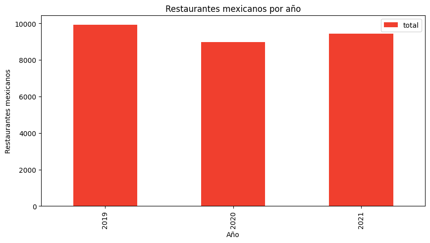
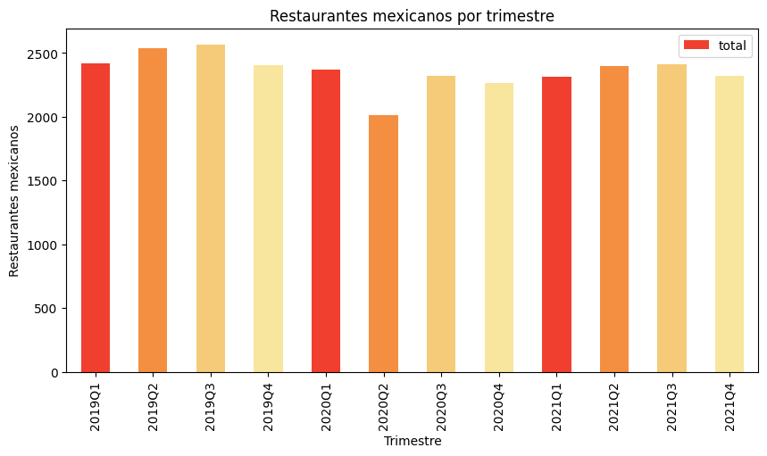
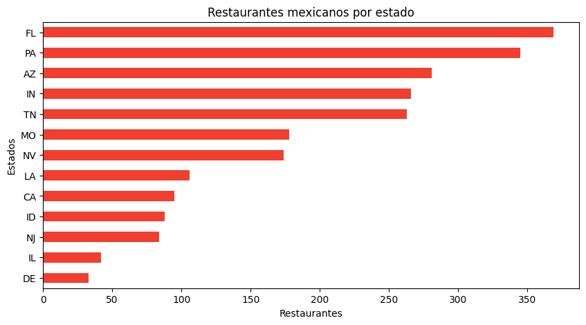
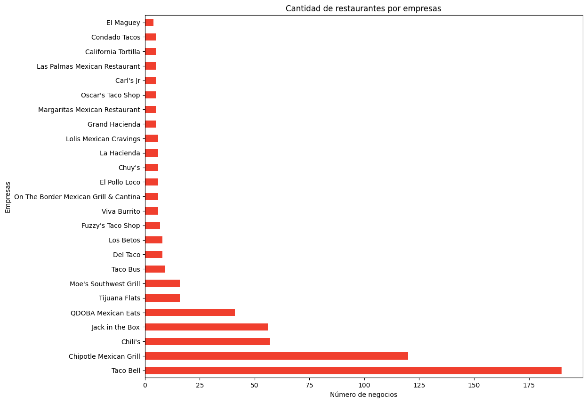
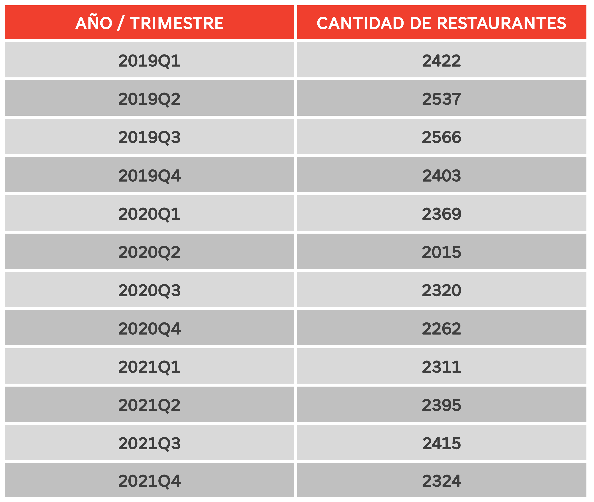
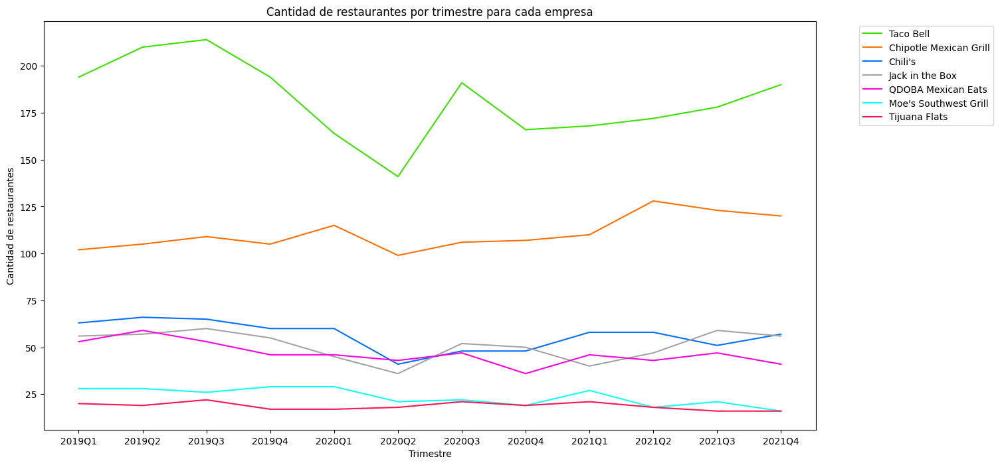
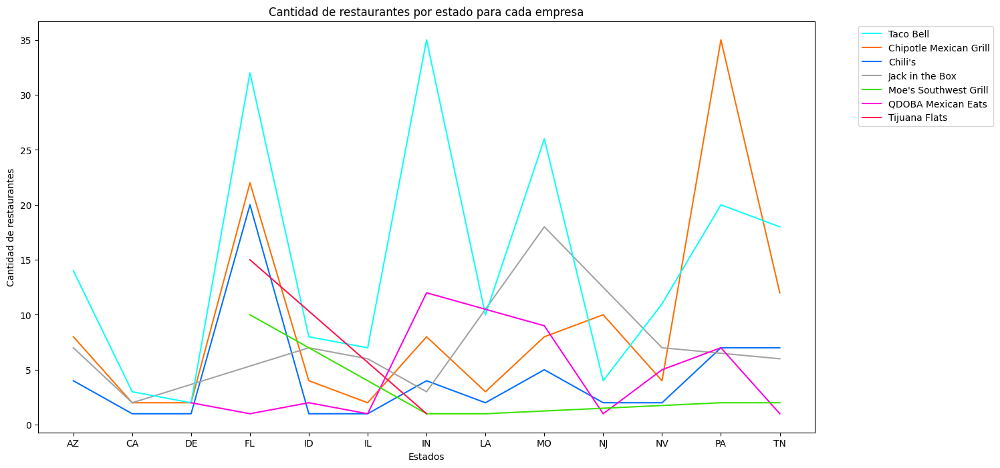
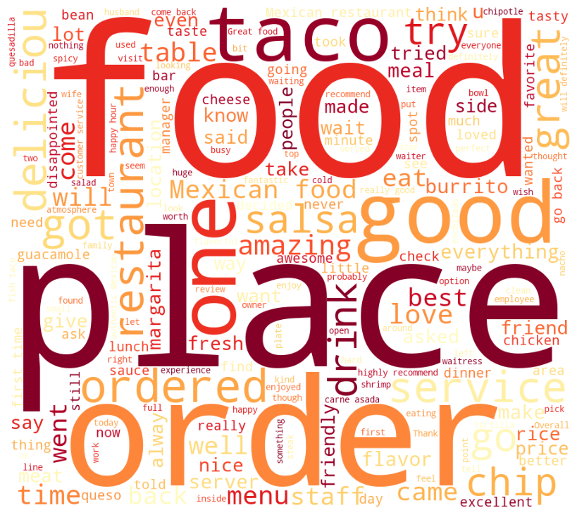

## 📊 *1. Dashboard*
armen un dashboard interactivo, junto con un análisis de los datos que hayan trabajado. Deben incluir los KPI 's que determinaron como importantes para el análisis realizado, y preparar un storytelling con el mismo.

- Versión online del dashboard 👉 [Visualización de datos](https://app.powerbi.com/view?r=eyJrIjoiNDc5MmY1YzgtYWMxOC00NjE1LWFiM2QtYzFjMmU0ZTVlYTdkIiwidCI6ImRmODY3OWNkLWE4MGUtNDVkOC05OWFjLWM4M2VkN2ZmOTVhMCJ9).

## 📈 *3. Resultado y discusión*

  

xxxxxxxxxxxxxx

  

xxxxxxxxxxxxxx

  

xxxxxxxxxxxxxx

  

xxxxxxxxxxxxxx

  

xxxxxxxxxxxxxxx

  

xxxxxxxxxxxxxxxxxx

  

xxxxxxxxxxxxxxxxxxx

  

xxxxxxxxxxxxxxxxxxx

  

xxxxxxxxxxxxxxxxxx

  

xxxxxxxxxxxxxxxxx

## 🦾 *2. Modelo de Machine Learning*
puede ser un MVP esta semana, y luego ser terminado para la última Demo)

- Modelo de Machine Learning 👉 [Sistema de recomendación](xxx).

