## 📊 *1. Dashboard*

Este es un dashboard interactivo realizado en Power BI, con una ingesta de datos automatizada periódicamente desde Bigquery de Google Cloud. 

Los datos provienen de la plataforma de Yelp y son procesados en la nube con análisis de sentimiento en un DAG en Python a través del Composer y Airflow. Abarca una amplia gama de tipos de accesos a los datos entrando por estados, año, reseñas de clientes y valoraciones por cantidad de estrellas. 

Se pueden observar las gráficas de evolución de 3 KPI, y consultar la geolocalización de restaurantes identificándolos por las valoraciones de clientes en cuanto a la valoración por cantidad de estrellas y reseñas. Podremos observar también porcentajes de aceptación y ranking de restaurants entre otras medidas.

- Versión online del dashboard 👉 [Visualización de datos](https://app.powerbi.com/view?r=eyJrIjoiNDc5MmY1YzgtYWMxOC00NjE1LWFiM2QtYzFjMmU0ZTVlYTdkIiwidCI6ImRmODY3OWNkLWE4MGUtNDVkOC05OWFjLWM4M2VkN2ZmOTVhMCJ9).

  

## 📈 *3. Resultado y discusión*
 
- Correlación entre variables 

 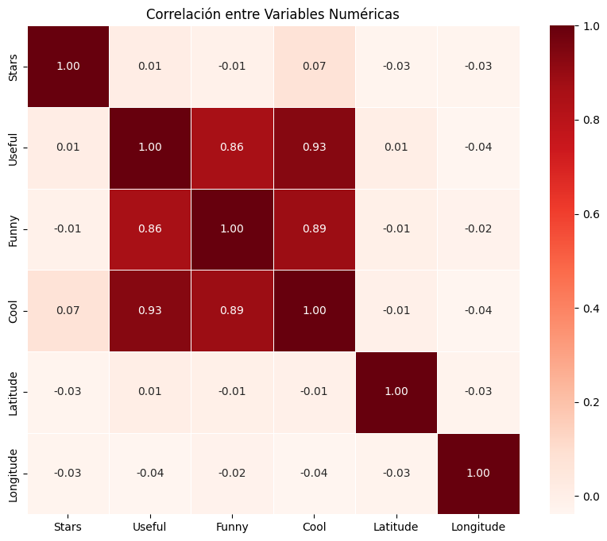 

- Cantidad de restaurantes mexicanos por año.

 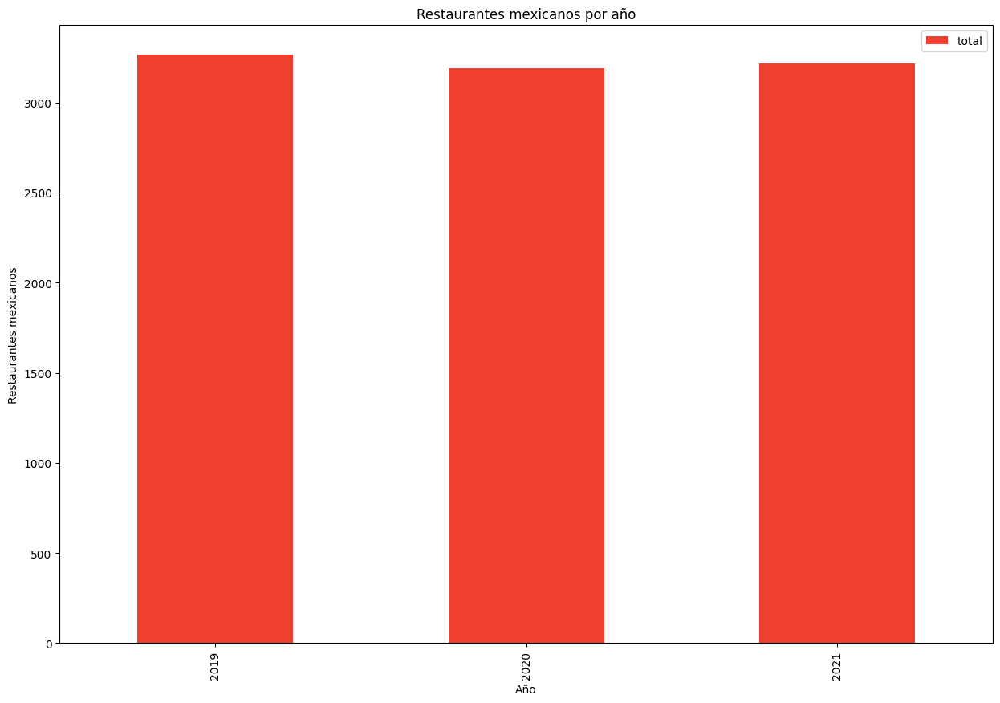 

 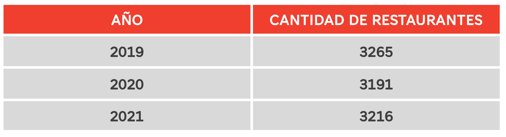 

- Cantidad de restaurantes mexicanos por trimestre.

  

  

- Cantidad de restaurantes mexicanos por estado.

 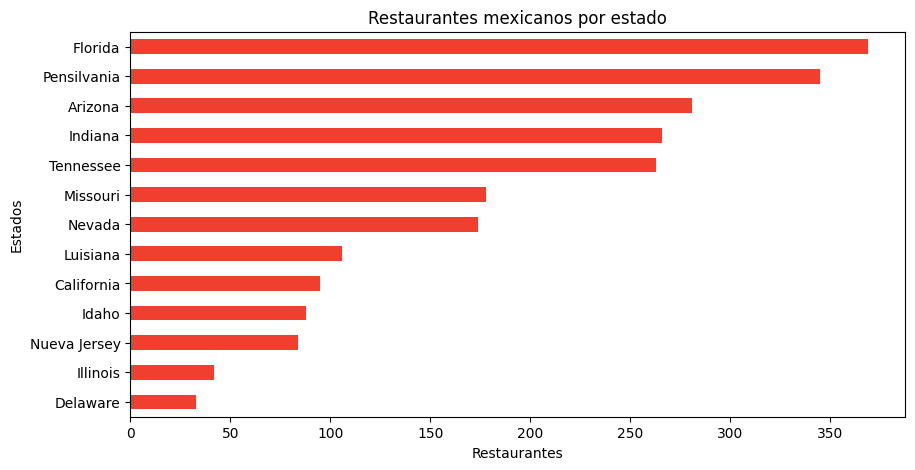 

  

- Cantidad de sucursales por empresa.

 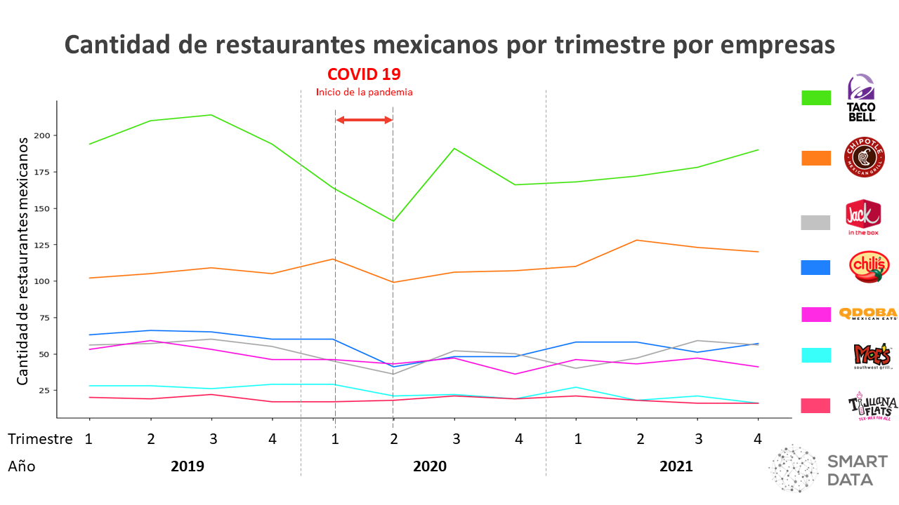 

  

 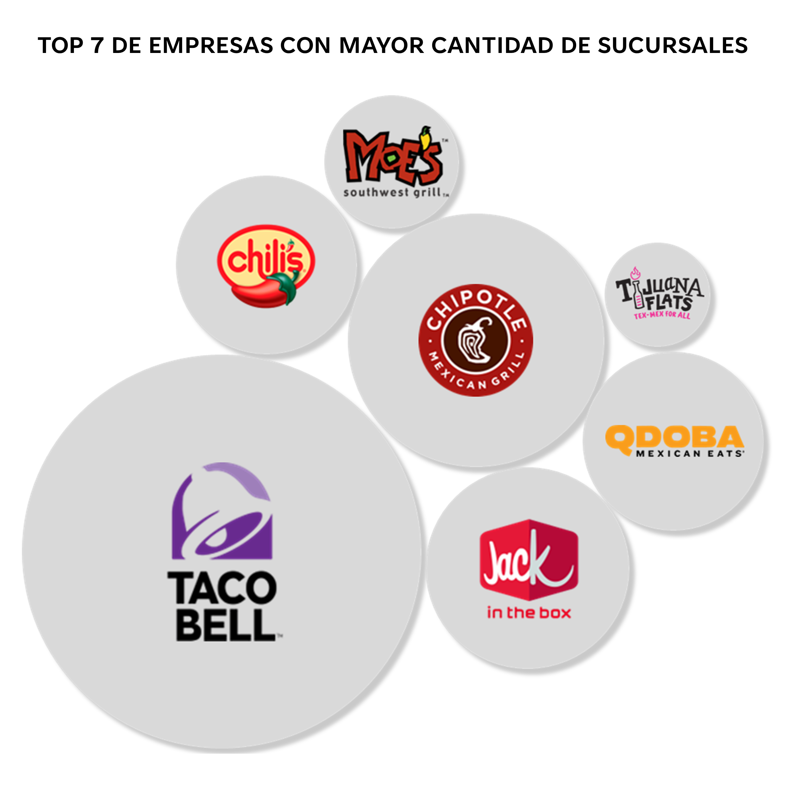 

- Evolución de la cantidad de sucursales por empresa por trimestre.

 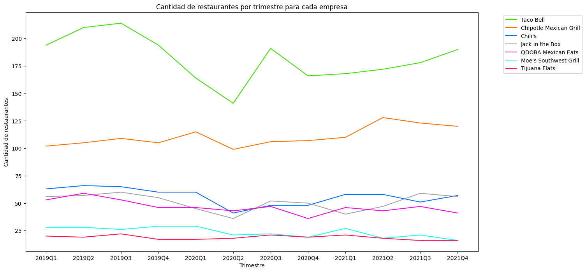 

 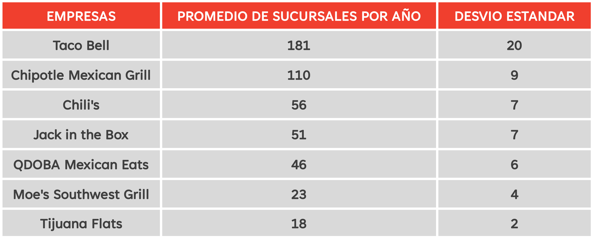 

- Cantidad de restaurantes mexicanos por empresa por estado.

 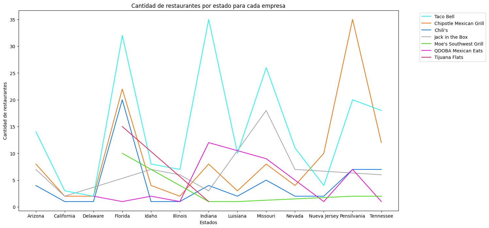 

- Calificación de los restaurantes mexicanos.

 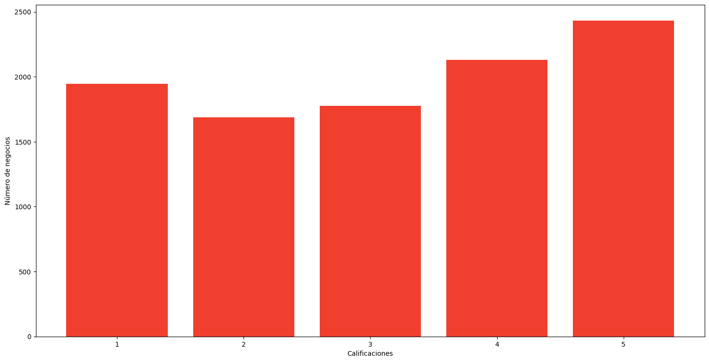 

- Nube de palabras de las reseñas de los clientes.

 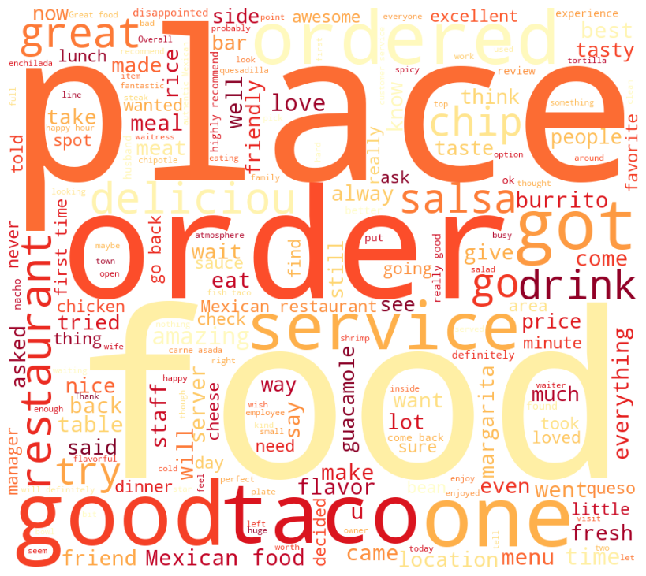 

 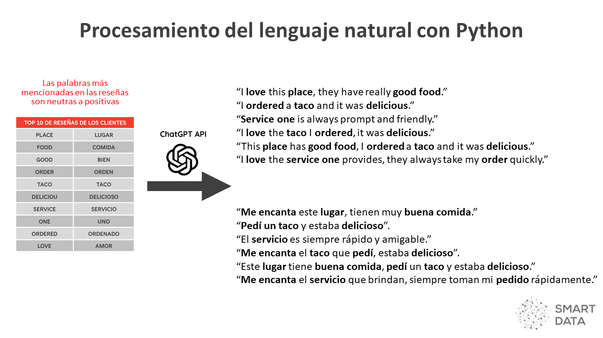 

## 🦾 *2. Modelo de Machine Learning*
puede ser un MVP esta semana, y luego ser terminado para la última Demo)

- Modelo de Machine Learning 👉 [Sistema de recomendación](xxx).

