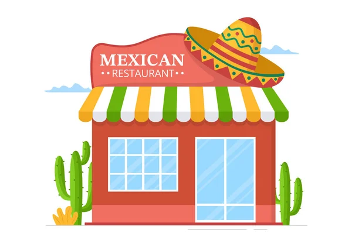

#  **
Proyecto Grupal Final de Data Science
** 

## 🚀 *1. Requerimientos del Proyecto*

Proyecto grupal final de la etapa de labs de la carrera de Data Science de la academia SoyHenry.

- [Los requerimiento del proyecto.](https://docs.google.com/document/u/0/d/e/2PACX-1vRtTsN_N3Z0DTLbh_-Xw2OxhOWeV5jmTISRUNzTBpWM9mTnxsT03674UheR4f0hfULc2v4_sW3IgDTv/pub?pli=1)

- [Criterios de evaluación del desempeño del grupo.](https://docs.google.com/document/d/1tBuh1LSCmvQB5Wd7-Cj4jj_o5zLk8vtBQFtDhF8oeSY/edit) 

- [Tener en cuenta el Disclaimer](https://docs.google.com/document/d/1k_uxvrMwVKjP_q1V_np9HmdtPTwjfL77uXJy2jZqnDE/edit?pli=1#heading=h.ntgoelrzlm1)

El **objetivo de este proyecto** tomar el **rol de una consultora** en Business Intelligence y Data Analytics, y realizar un análisis detallado de la **opinión de los usuarios** en Yelp y cruzarlos con los de Local Guides-Google Maps sobre un determinado negocio(farmacias, hoteles, restaurantes, turismo, ocio, etc).

## 📋 *2. Descripcion del Proyecto*

🍗🥗🍝🧀🍻 Muchos usuarios leen las reseñas de los lugares a los que planean ir, en base a esto toman decisiones sobre dónde comprar, comer, dormir, reunirse, etc. 

⭐⭐⭐⭐⭐ Esta información es muy valiosa para las empresas, ya que les sirve para enterarse de la imagen que tienen los los clientes de su negocio/producto/servicio.

  

                                                      

Se realizó un **análisis de mercado de los restaurantes mexicanos** que se encuentran en Estados Unidos y se evalúo sus desempeños durante una serie de tiempo (desde el año 2019 al primer trimestre del año 2022).

Para **evaluar el desempeño de los restaurantes** se planteó cuatro indicadores claves de desempeño (KPI) y un análisis de sentimiento.

Para **mejorar la experiencia del cliente** se realizó un sistema de recomendación.

## 📆 *3. Desarrollo del Proyecto*

El proyecto se llevo a cabo en tres etapas:

- 1° Etapa: Puesta en marcha del proyecto y Trabajo con Datos. 👉[Sprint#1](https://github.com/Hern4nOckham/Proyecto_grupalDS-Final/tree/main/3_Sprint%231)     

- 2° Etapa: Data Engineering. 👉[Sprint#2](https://github.com/Hern4nOckham/Proyecto_grupalDS-Final/tree/main/4_Sprint%232)

- 3° Etapa: Data Analytics y Machine Learning.🦾 👉[Sprint#3](https://github.com/Hern4nOckham/Proyecto_grupalDS-Final/tree/main/5_Sprint%233)

## 🗂️ *4. Datasets*

Los datasets fueron brindados por Henry:

- [Diccionario de datos](https://docs.google.com/document/d/1ASLMGAgrviicATaP1UJlflpmBCXtuSTHQGWdQMN6_2I/edit)
- [Local Guides-Google Maps](https://drive.google.com/drive/folders/1Wf7YkxA0aHI3GpoHc9Nh8_scf5BbD4DA)
- [Yelp](https://drive.google.com/drive/folders/1TI-SsMnZsNP6t930olEEWbBQdo_yuIZF)

## 📈 *5. Conclusíones*

📢📢📢📢Este proyecto esta en desarrollo, se prevee terminarl la primera semana de febrero del 2024. Apartir de esta fecha recien estara completo el proyecto.🚨🚨🚨🚨🚨

## 📚 *6. Bibliografia*

- [Fundación Carlo Slim](https://accesolatino.org/noticias/cuatro-datos-clave-de-la-poblacion-latina-en-ee-uu/)
- [Gruma](https://www.gruma.com/es/sala-de-prensa/noticias-y-comunicados/julio-19-2023-operaciones-de-gruma-fuera-de-mexico-impulsan-crecimiento-de-24percent-en-ventas-netas-y-31percent-en-ebitda-durante-el-2t23.aspx)
- [Google Cloud Platform](https://cloud.google.com/?utm_source=google&utm_medium=cpc&utm_campaign=latam-AR-all-es-dr-BKWS-all-all-trial-e-dr-1707800-LUAC0010192&utm_content=text-ad-none-any-DEV_c-CRE_512364917186-ADGP_Hybrid+%7C+BKWS+-+EXA+%7C+Txt+~+GCP_General-KWID_43700062788251533-kwd-155951229&utm_term=KW_gcp-ST_GCP&gad_source=1&gclid=Cj0KCQiAwP6sBhDAARIsAPfK_wZO2xHH_39r6R-gz3FIEwDkfOhCTJI52XpVYM1tde2rGBZirV02bKkaAqsgEALw_wcB&gclsrc=aw.ds&hl=es_419)
- [Apache Beam](https://beam.apache.org/documentation/programming-guide/#core-beam-transforms)
- [Diseño de pipelines de datos con GCP](https://www.youtube.com/watch?v=9UKxpK5-AZU)
- [Yelp Web](https://www.yelp.com/)
- [Emoji](https://github.com/ikatyang/emoji-cheat-sheet/blob/master/README.md#smileys--emotion)
- [Editar vídeos](https://online-video-cutter.com/es/change-video-speed)
- [Convertir vídeos](https://convertio.co/es/mp4-gif/)

## 👥 *7. Integrantes*

Henry Mentor:
- **Angela Aguirre**: aguirrealvareza97@gmail.com | Linkedin | GitHub.

Product Owner:
- **xxx**: xxx@gmail.com | Linkedin | GitHub.

**Grupo N° 1**:

Data Analyst / Data Science
  - **Marta Inés Pedriel**: martainesped@gmail.com | Linkedin | GitHub.
  - **Hernán Pizarro**: hern4npizarro@gmail.com | [Linkedin](www.linkedin.com/in/hernán-pizarro-683679268) | [GitHub](https://github.com/Hern4nOckham).

Data Engineer / Data Science
  - **Javier Baez Esqueda**: drbaez072@hotmail.com | Linkedin | GitHub.
  - **Carlos Antonio Baez**: cabaez2011@gmail.com | Linkedin | GitHub.
  - **Steven Yuval Barrantes Briceño**: stevenyb56@hotmail.com | Linkedin | GitHub.

## ⚠️ *8. Disclaimer*

De parte del equipo de Henry se quiere aclarar y remarcar que los fines de los proyectos propuestos son exclusivamente pedagógicos, con el objetivo de realizar proyectos que simulen un entorno laboral, en el cual se trabajen diversas temáticas ajustadas a la realidad. 

No reflejan necesariamente la filosofía y valores de la organización. Además, Henry no alienta ni tampoco recomienda a los alumnos y/o cualquier persona leyendo los repositorios (y entregas de proyectos) que tomen acciones en base a los datos que pudieran o no haber recabado. 

Toda la información expuesta y resultados obtenidos en los proyectos, nunca deben ser tomados en cuenta para la toma real de decisiones (especialmente en la temática de finanzas, salud, política, etc.).
